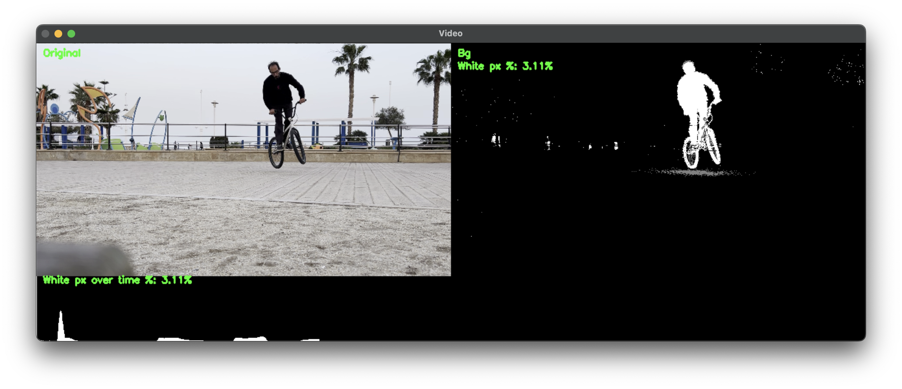

# OPENCV CLIP CUTTER



## Intro
When going out for a skate or BMX session, I often set up a tripod and record
it in order to analyze technique, check progression and find areas to improve. 
I then edit the clips in iMovie to remove everything but whatever trick I'm
doing. This is an attempt to automate that process. 

There are some reasons why I think a POC should not be too complicated:
- empty skatepark, no other people around
- most of the times I go out of camera between attempts, so simple motion
  tracking might suffice.
- background is static. 

I haven't done any OPENCV in many years, and never used pyhton before, so I
expect this project to be a learning ground too. 


## Requirements

- Python 3
- ffmpeg and ffprobe available on your `PATH`
- Python packages from `requirements.txt`

Install the Python dependencies:

```bash
python3 -m pip install -r requirements.txt
```

On macOS, ffmpeg can be installed with Homebrew:

```bash
brew install ffmpeg
```

## Usage

Run the detector against a source video:

```bash
python3 main.py path/to/session-video.mp4
```

The first run creates a low-resolution analysis copy next to the source video:

```text
path/to/session-video.downscaled.mp4
```

The tool analyzes that downscaled copy, detects motion segments, and prints the
number of segments found. Clip cutting is not implemented yet, so use `--plot`
to inspect and tune detection:

```bash
python3 main.py path/to/session-video.mp4 --plot
```

This writes a plot next to the source video:

```text
path/to/session-video.plot.png
```

The plot shows the raw motion signal, smoothed signal, start/end thresholds,
detected segments, and thumbnail masks sampled across the video.

## Options

```bash
python3 main.py path/to/session-video.mp4 \
  --plot \
  --sensitivity 1.5 \
  --min-clip-duration 1.0 \
  --min-gap 1.0
```

- `--plot`: save a detection plot instead of attempting to cut clips.
- `--sensitivity`: motion threshold in MAD units above the median noise floor.
  Lower values detect more motion; higher values are stricter. Default: `1.5`.
- `--min-clip-duration`: ignore detected segments shorter than this many
  seconds. Default: `1.0`.
- `--min-gap`: merge segments separated by less than this many seconds.
  Default: `1.0`.

## Tuning workflow

1. Start with `--plot` and the defaults.
2. If attempts are missed, lower `--sensitivity`, for example `1.0`.
3. If background motion creates false positives, raise `--sensitivity`, for
   example `2.0`.
4. Increase `--min-clip-duration` to ignore short spikes.
5. Increase `--min-gap` when one attempt is split into multiple segments.

Example:

```bash
python3 main.py "video/2024-02-22 22.06.36.mp4" --plot --sensitivity 1.2 --min-gap 2
```

## Validating detection

Manual labels can be created in LosslessCut by marking segments and exporting
them as CSV. Save the CSV next to the source video using the video filename plus
`.csv`:

```text
video/pre-segmented/test.mov
video/pre-segmented/test.mov.csv
```

Run the IoU validator against one video, one CSV, or a directory of labeled
videos:

```bash
python3 tools/validate_iou.py video/pre-segmented --details
```

The validator:

- reads LosslessCut `Start,End,Name` CSV files
- auto-detects whether `Start` and `End` are frames or seconds
- runs the current motion detector
- greedily matches manual and detected segments by highest IoU
- reports matches, misses, false positives, precision, recall, and average IoU

Useful options:

```bash
python3 tools/validate_iou.py video/pre-segmented \
  --iou-threshold 0.5 \
  --sensitivity 1.2 \
  --min-clip-duration 1.0 \
  --min-gap 2.0 \
  --details
```
